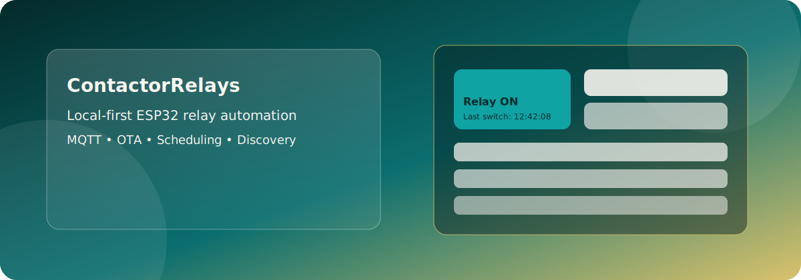
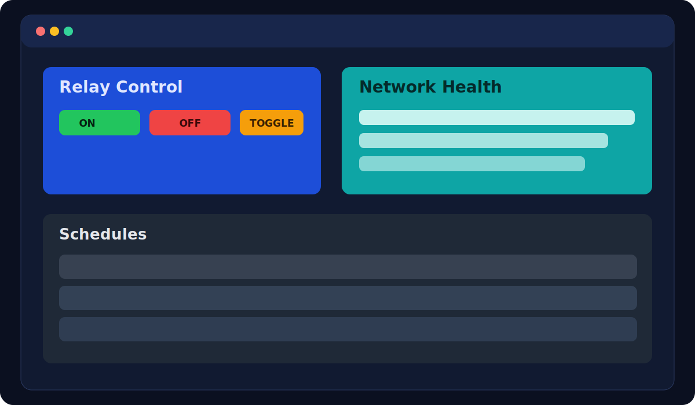
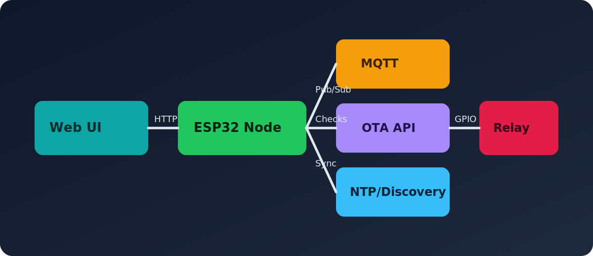

<!--
SPDX-License-Identifier: Apache-2.0
Copyright (c) 2026 Keith Jasper
Contact: https://github.com/keithjasper83/ESPRelays/issues
-->

# ContactorRelays



[](https://github.com/keithjasper83/ESPRelays/actions/workflows/ci.yml)
[](https://github.com/keithjasper83/ESPRelays/releases)
[](https://github.com/keithjasper83/ESPRelays/issues)
[](https://github.com/keithjasper83/ESPRelays/stargazers)
[](LICENSE)


ContactorRelays turns a small ESP32 board into a serious automation edge node:
fast local control, resilient remote commands, and enough scheduling intelligence
to run real-world devices without babysitting.

If you want "set it and trust it" relay control for home labs, utility spaces,
workshops, or small installations, this project is built for exactly that.

## Visual Preview



## Quick Demo Vibe


## System Flow At A Glance



## Why It Exists

- Local-first control that still plays nicely with MQTT and remote workflows.
- Practical automation features instead of demo-only gimmicks.
- Hardware-aware defaults for ESP32-C3 deployments.
- A clean base for extending into your own automation platform.

## Mission Statement: Your Hardware, Your Rules

We believe devices in your home should stay yours.

That means we do not hard-lock firmware into an unchangeable state by default.
Yes, security matters. A lot. But context matters too:

- This is home automation gear, not a nuclear launch console.
- The realistic threat model is usually inconvenience, not national-security meltdown.
- If someone hacks your relay and turns your TV off during Coronation Street,
  that is annoying and deeply rude, but it is not a state emergency.

So our design stance is simple:

- Prioritize secure defaults and transparent hardening options.
- Keep recovery and owner control possible.
- Avoid permanent lock-in that bricks ownership if support disappears.

If the company, cloud, or update server ever vanishes into the void, your kit
should still work in your house, on your terms, with firmware you can inspect
and replace.

Security should protect users, not trap them.

## Key Capabilities

- Web control endpoints for direct relay interaction and runtime configuration.
- MQTT command and telemetry integration for broker-driven automation.
- OTA check/update paths for safer firmware rollout.
- Time sync and schedule execution for repeatable behavior.
- UDP discovery for quick device visibility on the network.

## Ideal Use Cases

- Smart home relay control with local fallback behavior.
- Workshop and utility automation with low-latency switching.
- Prototype control nodes for larger IoT systems.
- Learning reference for production-minded ESP32 service architecture.

## Roadmap Ideas

Short-term:
- Better setup UX in the web panel with stronger validation and onboarding hints.
- Richer diagnostics endpoint for easier field troubleshooting.
- More contract tests around config and scheduling edge cases.
- Auto-off from last-off style function (design and review only, not implemented yet).

Mid-term:
- Role-based web auth options and hardened security defaults.
- Scene and rule primitives (for example "if this then switch that").
- Enhanced telemetry model for fleet-level observability.

Long-term:
- Multi-device coordination patterns.
- Optional cloud bridge modules while keeping local-first behavior.
- Deployment profiles for home, lab, and light industrial scenarios.

Engineering review backlog:
- See [TODO_REVIEW.md](TODO_REVIEW.md) for nitpick-level code review and hardening items.

## Suggest Features And Improvements

The best ideas usually come from real installs. If you have a suggestion:

- Open an issue at https://github.com/keithjasper83/ESPRelays/issues.
- Start the title with one of: `Feature:`, `Idea:`, `Roadmap:`.
- Include your use case, what hurts today, and what success looks like.
- If possible, add hardware details and expected command flow.

Fast template you can paste into an issue:

```md
## Problem
What is hard today?

## Proposal
What should change?

## Value
Why this matters in real usage.

## Environment
Board, firmware version, network setup, and MQTT usage (if any).
```

## Contact

- Suggestions and bugs: https://github.com/keithjasper83/ESPRelays/issues
- Trademark/branding permissions: see [TRADEMARKS.md](TRADEMARKS.md)

## License

This project is licensed under Apache License 2.0.
See [LICENSE](LICENSE) and [NOTICE](NOTICE) for required attribution and
redistribution notices.

## Attribution

If you redistribute this project or derivatives, you must retain:
- License text (Apache-2.0)
- Copyright notices
- NOTICE attributions

## Branding

Code is open under Apache-2.0, but project branding (names/logos) is not
licensed for unrestricted use.
See [TRADEMARKS.md](TRADEMARKS.md).
