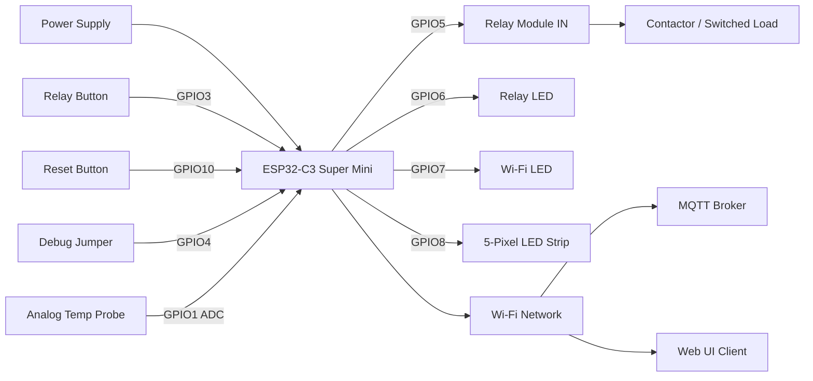

<!--
SPDX-License-Identifier: Apache-2.0
Copyright (c) 2026 Keith Jasper
Contact: https://github.com/keithjasper83/ESPRelays/issues
-->

# Wiring Guide (ESP32-C3 Super Mini)

This document reflects the current firmware pin map defined in `src/AppConfig.h`.

## Safety Policy

To reduce field failures and boot issues, this project intentionally avoids known ESP32-C3 strapping/boot-sensitive GPIOs for user I/O where practical.

Pins intentionally avoided for user control paths:
- `GPIO0`
- `GPIO2`
- `GPIO9`

**GPIO8**: Reserved for optional 5-pixel addressable LED strip (WS2812B/NeoPixel). Safe for this purpose.

**GPIO9 / BOOT**: Keep free for the board's BOOT button. With the firmware running, hold it for 5 seconds to clear all saved user settings (including Wi-Fi) and reboot using the compiled defaults. Do not hold BOOT while pressing the physical RESET button: GPIO9 is a boot strapping pin and that combination enters the ROM downloader rather than the firmware.

## Active Pin Map

| Signal | GPIO | Direction | Purpose | Notes |
|---|---:|---|---|---|
| Relay output | 5 | Output | Drives relay module input | `RELAY_ACTIVE_LOW=false` in current defaults |
| Relay status LED | 6 | Output | Relay state indicator + LED test | Controlled by firmware LED manager |
| Wi-Fi status LED | 7 | Output | Wi-Fi state indicator + LED test | Pulse/blink logic when connected |
| Relay button | 3 | Input | Local relay toggle button | Debounced in firmware |
| Reset button | 10 | Input | Manual device restart trigger | Debounced in firmware |
| Debug jumper | 4 | Input | Enable debug logging mode | Pull-up input |
| Temperature probe (ADC) | 1 | Input (ADC) | Analog temperature probe reading | 12-bit ADC, sampled every 1s |
| Addressable LED data | 8 | Output | 5-pixel WS2812B/NeoPixel GRB strip | Optional, 80% brightness safety limit |

## Block Diagram



## Addressable LED Strip Installation

### Hardware Requirements

- **Strip Type**: WS2812B or WS2811/WS2812-compatible 5080 or 6060 5-pixel strip
- **Colour Order**: GRB (Green-Red-Blue) internally
- **Data Pin**: GPIO 8 (confirmed safe for this board)
- **Power**: 5V supply capable of 100-200mA (5 pixels × ~40mA each)
- **Recommended**: 100µF decoupling capacitor between 5V and GND near strip

### Wiring

```
ESP32-C3 Super Mini          LED Strip (5-pixel)
-------------                -------------------
GPIO 8 (Data) --> D (Data)   Data line
5V (3.3V tolerant) --> V+    Power input
GND --> GND                  Common ground (REQUIRED)
```

**Important**: Common ground between ESP32 and LED strip is mandatory for reliable data transmission.

### Electrical Notes

- The ESP32-C3 GPIO 8 pin can drive WS2812B data signals directly for 5 pixels
- Add a 220Ω series resistor between GPIO 8 and strip data input if experiencing data errors
- Power the strip from a separate 5V regulator if controlling more than 10 pixels
- For 5 pixels, the onboard 5V rail is typically sufficient

### Safety Limit

- **Hard brightness ceiling**: 80% (204/255 on 0-255 scale)
- This limit is enforced at the final output boundary and cannot be bypassed
- Applies to all sources: API, MQTT, configuration, animation, manual control

## Temperature Calibration Notes

- Calibration supports either Celsius or Fahrenheit entry in the web UI.
- Values are converted and stored internally in Celsius.
- A persistent trim offset is available for post-install fine adjustment.

## Validation Checklist

- Confirm relay output logic level matches relay module requirements.
- Confirm LED polarity if hardware uses active-low LED wiring.
- Confirm buttons are wired with stable pull-up/pull-down behavior.
- Keep wiring clear of high-voltage lines if relay is switching mains circuits.
- If using addressable LED strip: verify common ground connection and data integrity.
- Test LED strip brightness controls via web UI and MQTT before final deployment.

## Build and Test

### Build
```bash
pio run --target build
```

### Flash
```bash
pio run --target upload
```

### Monitor
```bash
pio device monitor
```

### Verify LED Strip
1. Power on the device with LED strip connected
2. Observe progressive fill boot animation (cyan to green gradient, 2 seconds)
3. Open web UI at http://homerelay.local
4. Check LED status: LED 0 (Health), LED 1 (Network), LED 2 (Controller), LED 3 (Relay), LED 4 (Activity)
5. Test brightness controls:
   - Set master brightness (0-204)
   - Set per-LED brightness (0-204)
   - Verify hard limit is enforced (max 204)
6. Test status changes:
   - Health LED (0) shows green when healthy, red on fault
   - Network LED (1) shows green when connected, red on failure
   - Controller LED (2) shows green when configured
   - Relay LED (3) shows cyan when active, green when idle
   - Activity LED (4) shows amber on activity/pulse
