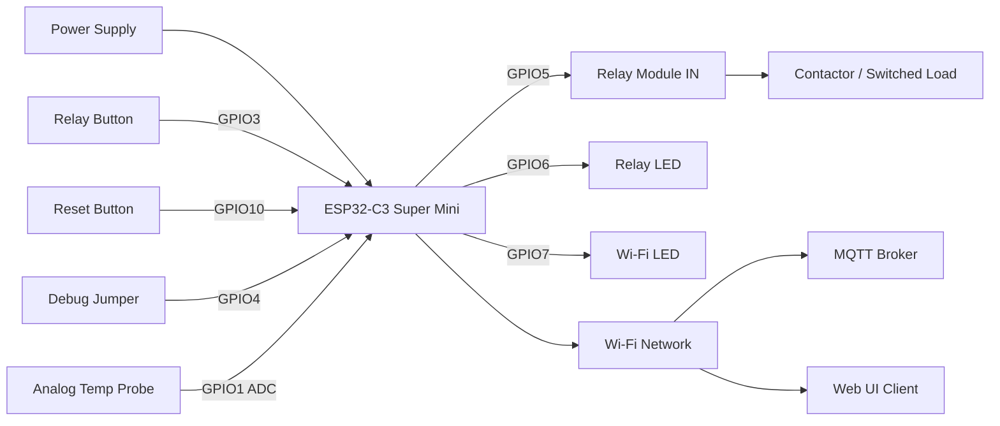

<!--
SPDX-License-Identifier: Apache-2.0
Copyright (c) 2026 Keith Jasper
Contact: https://github.com/keithjasper83/ESPRelays/issues
-->

# Wiring Guide (ESP32-C3 Super Mini)

This document reflects the current firmware pin map defined in `src/AppConfig.h`.

## Safety Policy

To reduce field failures and boot issues, this project intentionally avoids known ESP32-C3 strapping/boot-sensitive GPIOs for user I/O where practical.

Pins intentionally avoided for user control paths:
- `GPIO0`
- `GPIO2`
- `GPIO8`
- `GPIO9`

## Active Pin Map

| Signal | GPIO | Direction | Purpose | Notes |
|---|---:|---|---|---|
| Relay output | 5 | Output | Drives relay module input | `RELAY_ACTIVE_LOW=false` in current defaults |
| Relay status LED | 6 | Output | Relay state indicator + LED test | Controlled by firmware LED manager |
| Wi-Fi status LED | 7 | Output | Wi-Fi state indicator + LED test | Pulse/blink logic when connected |
| Relay button | 3 | Input | Local relay toggle button | Debounced in firmware |
| Reset button | 10 | Input | Manual device restart trigger | Debounced in firmware |
| Debug jumper | 4 | Input | Enable debug logging mode | Pull-up input |
| Temperature probe (ADC) | 1 | Input (ADC) | Analog temperature probe reading | 12-bit ADC, sampled every 1s |

## Block Diagram

## Temperature Calibration Notes

- Calibration supports either Celsius or Fahrenheit entry in the web UI.
- Values are converted and stored internally in Celsius.
- A persistent trim offset is available for post-install fine adjustment.

## Validation Checklist

- Confirm relay output logic level matches relay module requirements.
- Confirm LED polarity if hardware uses active-low LED wiring.
- Confirm buttons are wired with stable pull-up/pull-down behavior.
- Keep wiring clear of high-voltage lines if relay is switching mains circuits.
