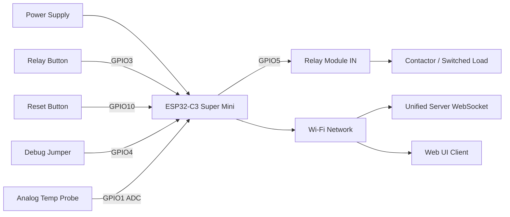

<!--
SPDX-License-Identifier: Apache-2.0
Copyright (c) 2026 Keith Jasper
Contact: https://github.com/keithjasper83/ESPRelays/issues
-->

# Wiring Guide (ESP32-C3 Super Mini)

This document reflects the current firmware pin map defined in `src/AppConfig.h`.

## Safety Policy

To reduce field failures and boot issues, this project intentionally avoids known ESP32-C3 strapping/boot-sensitive GPIOs for user I/O where practical.

Pins intentionally avoided for user control paths:
- `GPIO0`
- `GPIO2`
- `GPIO9`

GPIO6, GPIO7 and GPIO8 are not driven by this firmware. Disconnected indicator
and strip support has been removed; no replacement pin use is introduced.

**GPIO9 / BOOT**: Keep free for the board's BOOT button. With the firmware running, hold it for 5 seconds to clear all saved user settings (including Wi-Fi) and reboot using the compiled defaults. Do not hold BOOT while pressing the physical RESET button: GPIO9 is a boot strapping pin and that combination enters the ROM downloader rather than the firmware.

## Active Pin Map

| Signal | GPIO | Direction | Purpose | Notes |
|---|---:|---|---|---|
| Relay output | 5 | Output | Drives relay module input | `RELAY_ACTIVE_LOW=false` in current defaults |
| Relay button | 3 | Input | Local relay toggle button | Debounced in firmware |
| Reset button | 10 | Input | Manual device restart trigger | Debounced in firmware |
| Debug jumper | 4 | Input | Enable debug logging mode | Pull-up input |
| Temperature probe (ADC) | 1 | Input (ADC) | Analog temperature probe reading | 12-bit ADC, sampled every 1s |

## Block Diagram


```mermaid
flowchart LR
    PSU[Power Supply] --> ESP[ESP32-C3 Super Mini]

    ESP -->|GPIO5| RELAY[Relay Module IN]
    RELAY --> LOAD[Contactor / Switched Load]


    BTN1[Relay Button] -->|GPIO3| ESP
    BTN2[Reset Button] -->|GPIO10| ESP
    JDBG[Debug Jumper] -->|GPIO4| ESP

    PROBE[Analog Temp Probe] -->|GPIO1 ADC| ESP

    ESP --> WIFI[Wi-Fi Network]
    WIFI --> UNIFIED[Unified Server WebSocket]
    WIFI --> WEB[Web UI Client]
```

## Temperature Calibration Notes

- Calibration supports either Celsius or Fahrenheit entry in the web UI.
- Values are converted and stored internally in Celsius.
- A persistent trim offset is available for post-install fine adjustment.

## Validation Checklist

- Confirm relay output logic level matches relay module requirements.
- Confirm buttons are wired with stable pull-up/pull-down behavior.
- Keep wiring clear of high-voltage lines if relay is switching mains circuits.

## Build and Test

### Build
```bash
pio run --target build
```

### Flash
```bash
pio run --target upload
```

### Monitor
```bash
pio device monitor
```
